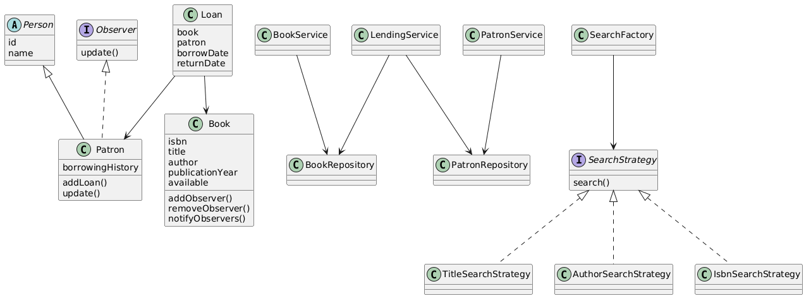

# Library Management System

## Overview

This project is a console-based Library Management System developed in Java. It allows librarians to manage books, patrons, lending operations, reservations, and notifications. The project demonstrates Object-Oriented Programming (OOP), SOLID principles, and design patterns.

---

## Features

### Book Management

* Add books
* Remove books
* Update book details
* Search books by Title
* Search books by Author
* Search books by ISBN

### Patron Management

* Register patrons
* View patron details
* Track borrowing history

### Lending Management

* Checkout books
* Return books
* Track active loans

### Reservation System

* Reserve books that are currently borrowed
* Notify patrons when reserved books become available

---

## OOP Concepts Used

### Encapsulation

Book, Patron, and Loan classes use private fields with public methods for controlled access.

### Inheritance

Patron extends the abstract Person class.

### Abstraction

SearchStrategy and Observer interfaces define contracts for behavior.

### Polymorphism

Different search strategies are accessed through the SearchStrategy interface.

---

## Design Patterns

### Strategy Pattern

Used to support different search mechanisms:

* TitleSearchStrategy
* AuthorSearchStrategy
* IsbnSearchStrategy

### Observer Pattern

Used to implement the reservation notification system.

* Book acts as the Subject
* Patron acts as the Observer

### Factory Pattern

SearchFactory is used to create the appropriate search strategy.

---

## Project Structure

```text
src
├── model
│   ├── Book.java
│   ├── Person.java
│   ├── Patron.java
│   └── Loan.java
│
├── repository
│   ├── BookRepository.java
│   └── PatronRepository.java
│
├── service
│   ├── BookService.java
│   ├── PatronService.java
│   └── LendingService.java
│
├── strategy
│   ├── SearchStrategy.java
│   ├── TitleSearchStrategy.java
│   ├── AuthorSearchStrategy.java
│   └── IsbnSearchStrategy.java
│
├── observer
│   └── Observer.java
│
├── factory
│   └── SearchFactory.java
│
└── Main.java
```

---

## Class Diagram



---

## How to Run

1. Clone the repository.

2. Open the project in IntelliJ IDEA.

3. Build the project.

4. Run Main.java.

---

## Sample Workflow

1. Add books to the library.
2. Register patrons.
3. Checkout a book.
4. Reserve a borrowed book.
5. Return the borrowed book.
6. Receive notification when the reserved book becomes available.

---

## Future Enhancements

* Database integration
* Spring Boot REST APIs
* Authentication and authorization
* Fine management system
* Due date tracking
* Email notifications
